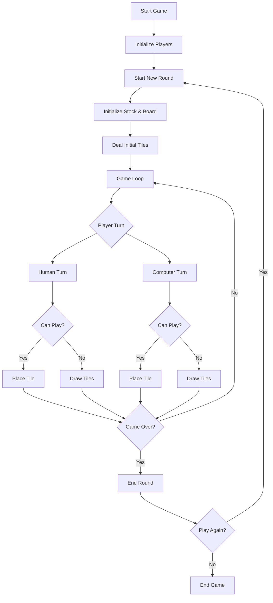
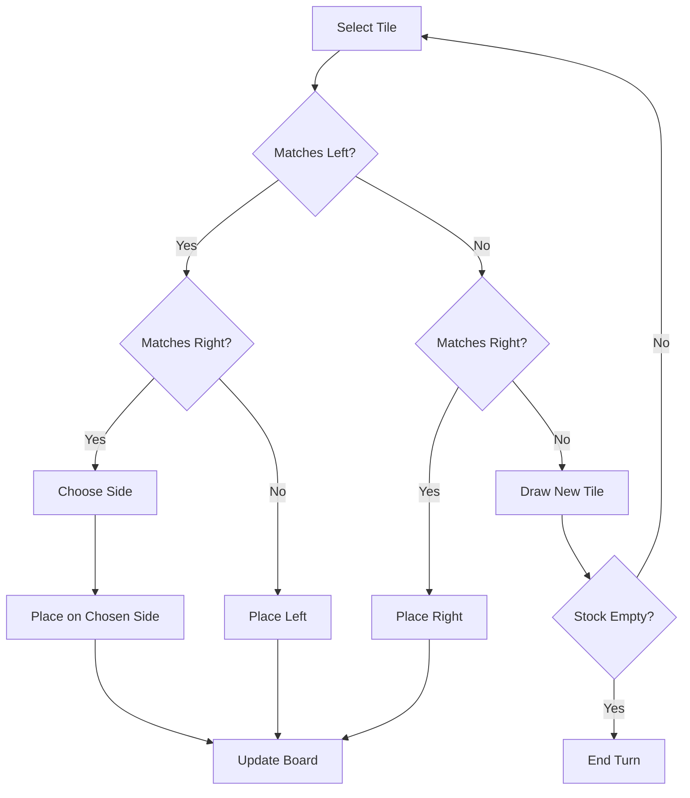
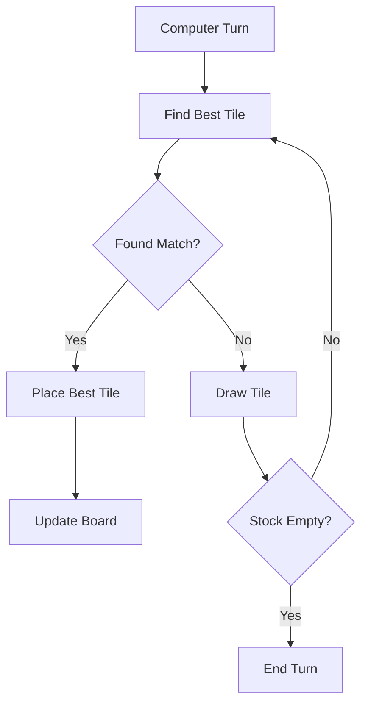

# Dominoes Game

A Java implementation of the classic Dominoes game, featuring a human player against a computer opponent.

## Game Overview

This is a two-player Dominoes game where one player is human and the other is computer-controlled. The game uses a standard set of 28 domino tiles (double-six set) where each tile has two values ranging from 0 to 6.

## Game Rules

1. Each player starts with 7 tiles drawn from the stock
2. Players take turns placing tiles on the board
3. A tile can be placed if at least one of its values matches the exposed end values of the chain
4. If a player cannot play, they must draw tiles from the stock until they can play or the stock is empty
5. The game ends when:
   - A player empties their hand (they win)
   - Both players cannot play and the stock is empty (player with fewer points in hand wins)
6. Points are awarded to the winner based on the opponent's remaining tiles

## Game Structure

The game is implemented using several key classes:

- `DominoesGame`: Main game class that handles the game loop
- `DominoesRound`: Manages individual rounds
- `Player`: Represents both human and computer players
- `Board`: Manages the game board and tile placement
- `Stock`: Handles the tile stock and drawing
- `Hand`: Manages player's tiles
- `Tile`: Represents individual domino tiles
- `Chain`: Implements the chain of played tiles
- `ChainElement`: Represents elements in the chain

## Game Flow

### Main Game Flow

### Tile Placement Logic

### Computer Player Logic

## How to Play

1. Run the game using `java DominoesGame`
2. Enter your name when prompted
3. During your turn:
   - View your hand and the current board state
   - Select a tile by its position number (0-6)
   - Choose placement side if the tile matches both ends
   - Enter -1 to draw a new tile if you can't play
4. The computer will automatically play its turn
5. After each round, choose whether to play again

## Scoring System

- Each tile's value is the sum of its two numbers
- When a player wins by emptying their hand, they receive points equal to the opponent's remaining tiles
- In case of a blocked game, the player with fewer points in their hand wins and receives the opponent's points

## Implementation Details

The game uses a doubly-linked list implementation (Chain) to maintain the board state, allowing efficient tile placement at both ends. The computer player uses a simple strategy of always playing the highest-value matching tile available.

## Author

John Morfidis